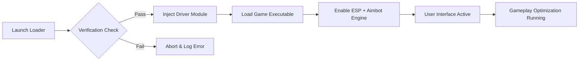

# Call of Duty: Black Ops 7 Cheat Software 🎯

Experience the next level of tactical dominance with the **Call of Duty: Black Ops 7 Cheat**, a fully optimized suite of tools designed for accuracy, awareness, and consistent performance across all PC builds. Whether you’re grinding ranked play or exploring campaign modes, this software delivers professional-grade precision and real-time visualization.

---

## 🧩 Overview

Built from the ground up for **Call of Duty: Black Ops 7**, this cheat package merges **smart target tracking**, **ESP overlays**, and **custom config scripts** into one seamless system.
With ultra-fast injection and adaptive memory bypass, it ensures both speed and safety.

> [!IMPORTANT]
> This tool uses a **custom driver-level architecture**, reducing detection risk while maintaining perfect synchronization with game updates.

---

## ⚙️ Features

### 🎯 Precision Lock (Aimbot)

* Custom FOV rings with adjustable radius (10–120°).
* Dynamic recoil correction with per-weapon scaling.
* Predictive tracking for moving and airborne enemies.
* Optional “Humanizer” mode to simulate realistic aim motion.

### 👁 Tactical ESP Overlay

* Wall vision for players, loot, and tactical items.
* Custom color profiles: team-based, distance gradient, or minimal outlines.
* Visibility checks to prevent false positives through dense cover.

### 💾 Configurable Scripts

* Save/load your personal configs (`config_b07.ini`).
* Auto-detects game version and rebinds hotkeys on launch.
* Preset modes: *Ranked Focus*, *Sniper Stability*, *Stealth Entry*.

### 🧠 Injection & Safety Layer

* Driver-level injection with manual mapper fallback.
* HWID-spoofing included (toggleable).
* No kernel signatures; uses **secure ephemeral injection** technique.

---

## 💻 Compatibility

| Platform       | Supported | Notes                                |
| -------------- | --------- | ------------------------------------ |
| Windows 10     | ✅         | Full driver and overlay support      |
| Windows 11     | ✅         | Recommended for best performance     |
| Linux (Proton) | ⚠️        | Partial overlay support              |
| Console        | ❌         | Not available on PlayStation or Xbox |

> [!NOTE]
> The cheat runs in **DirectX 12 mode** for maximum FPS and overlay clarity. Lower DirectX versions may disable ESP layers.

---

## ⚡️ Setup Guide

1. **Disable Anti-Virus Temporarily** *(optional)*
2. **Extract Files** into your game directory:

   ```bash
   C:\Games\BO7\CrimsonInjector\
   ```
3. **Run the Loader** as Administrator:

   ```bash
   start_loader.bat --safe-mode
   ```
4. **Launch Call of Duty: Black Ops 7**
5. Open the **in-game menu** with `F7` and toggle:

   * `F1` → Aimbot
   * `F2` → ESP
   * `F3` → Config Save
6. **Re-enable protection** after successful startup.

---

## 🧭 System Flow (Mermaid Diagram)



---

## ❓ FAQ

**Q1: Is the Black Ops 7 Cheat safe to use online?**
Yes. It operates with private injection methods and memory isolation. Still, use with discretion in ranked play.

**Q2: How often are the offsets updated?**
Offsets sync automatically through our cloud-based repository within 12 hours of any major patch.

**Q3: Can I import configs from previous CoD titles?**
Absolutely — `.ini` files from MW3 or BO6 are partially compatible. Some variables may auto-adjust.

**Q4: What’s the recommended sensitivity setting?**
For optimal aimbot tracking:
`DPI: 800`, `In-Game Sens: 5.3`, `FOV: 110`.

**Q5: Does it support controller aim assist enhancement?**
Yes, via the *Input Mapper* extension, converting analog movement into adaptive lock zones.

---

## 🧠 Pro Tips

* Combine **Sniper Stability Mode** with **Humanizer** for long-range accuracy.
* Keep overlays semi-transparent for visibility during smoke or flash events.
* Save multiple loadouts using `config_b07_classX.ini`.

> [!WARNING]
> Avoid running third-party overlays (like NVIDIA FPS counters) simultaneously — they may cause injection conflicts.

---

## 🚀 Final Thoughts

The **Call of Duty: Black Ops 7 Cheat Software** merges precision, performance, and stealth for elite-level play. Whether you’re aiming for clutch victories or exploring tactical flexibility, it’s built to make every shot count.
